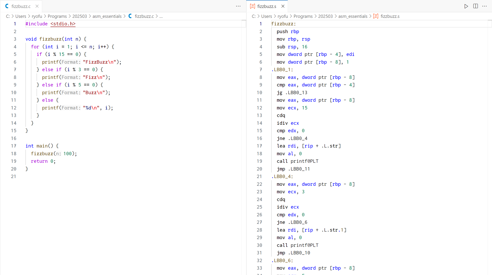
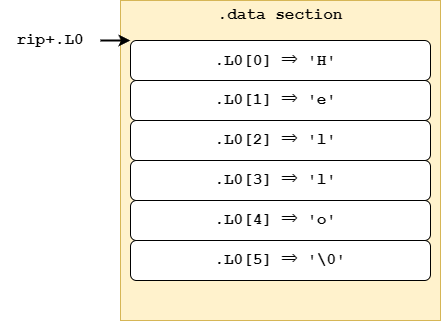

<style scoped>
section {
  display: flex;
  align-items: center;
  justify-content: center;
}
</style>

# x86-64 Assembly 入門

---


# 自己紹介

- 名前：
  **Latte72**
- 肩書：
  2025年度 System班 班長
- よく使う言語：
  Python, C, JavaScript, etc...
- SNSなど
  HP：https://latte72.net/
  X：**@Latte72R**

---

# はじめに

とりあえずアセンブリで **8 * 9** を計算してみます（あとで解説します）

```x86asm
.intel_syntax noprefix
.globl main
main:
  mov rax, 8
  mov rbx, 9
  imul rax, rbx
  ret
```

---

# このスライドで解説すること
- x86-64 アセンブリ言語の基礎的な文法

# このスライドで解説しないこと

- C言語の文法
- x86-64 アセンブリ言語の発展的な文法
- x86-64 以外のアセンブリ言語

---

# お約束

- このスライドで注意書きなしにアセンブリ言語と書いた場合は x86-64 の
  アセンブリを指すこととします
- このスライドでは GNU アセンブリの **Intel 記法** を用います
  アセンブリの１行目に `.intel_syntax noprefix` と記述してください
- メイン関数のみ外部からアクセスできるように設定します
  アセンブリの２行目に `.globl main` と記述してください
- このスライドではSyntax hilightingの関係で`;`をコメント用記号として用いますが、GNU Assemblerではコメント用記号として`#`を使うことに注意してください

---

# アセンブリ言語とは

- C言語やPythonなどと比べ、ハードウェアに近い低レベルのプログラミング言語
- プログラムの各命令がCPUの動作に直結しているため、詳細な制御が可能
- コンピュータの種類によって **x86-64**, **Arm64**, **RISV-V** などの多くの種類がある

# x86-64アーキテクチャの概要
- x86-64は、64bit CPU向けの命令セットアーキテクチャでIntelとAMDによって
  採用されている（大半のWindows PCと2015年以前のMacintosh）
- 歴史的な経緯から8bitや16bitの命令もサポートしておりやや統一性に欠ける

---

# 命令

**命令**とは、CPUに具体的な動作を指示するためのものです
（個々の命令の説明は後で行います）

### 命令の種類<small>（一部）</small>

- 算術演算命令
- データ転送命令
- スタック操作命令

仕様により、基本的にメモリからメモリへの直接の演算は許されていません
**両方のオペランドがメモリの場合はエラーになるので注意してください**

---

# レジスタ

**レジスタ**は、データの一時保存や演算結果の保持、関数呼び出し時の管理などに
使われます
（個々のレジスタの説明は後で行います）

### レジスタの種類<small>（一部）</small>

- 汎用レジスタ
- 関数の引数用レジスタ
- スタック関連レジスタ

---

# スタック

**スタック**とは関数内の一時データ保存に用いるものです
データを保存する棚のようなものだと理解するといいかもしれません

スタックには高位アドレスから下位アドレスに向かってデータを配置していきます

個人的にはスタックの理解がアセンブリを理解する中で最もハードルが高いと思っています

---

### スタックのイメージ

※ 上側が下位アドレスです

<small>出典：https://qiita.com/kaito_tateyama/items/89272098f4b286b64115 </small>

---

# スタック関連レジスタ

スタックを管理するために使います

- **rsp**
  *Stack Pointer*, スタックの先頭位置を示します

- **rbp**
  *Base Pointer*, 関数内でローカル変数の位置の基準として利用します

- **rip**
  *Instruction Pointer*, 次に実行する命令のアドレスを記録します

---

# スタック操作命令
- **push**
  データをスタック（rspの位置）に積みます
  **rsp** は自動的にデータのサイズ分移動します
- **pop**
  スタック（rspの位置）からデータを取り出して指定したレジスタに格納します
  **rsp** は自動的にデータのサイズ分移動します

---

# 汎用レジスタ

主に演算結果や関数の戻り値を保持します
**rax**, **rbx**, **rcx**, **rdx** などがあり、計算やデータ操作に用います

これらのレジスタは基本的に意味のないものとして扱われますが、処理によっては
特別な意味を持っていることもあります

例）**rax** は関数の戻り値を表すために用いられます

---

### 汎用レジスタの構造

**rax**は64bitあり、その下位32bitが**eax**レジスタ、そのさらに下位16bitが**ax**レジスタ、
その上位8bitが**ah**レジスタ、下位8bitが**al**レジスタとなっています、

**rbx**, **rcx**, **rdx** も同じ構造です


<small>出典：https://qiita.com/kaito_tateyama/items/89272098f4b286b64115 </small>

---

# アドレスのサイズ指定

アドレスのサイズを表す場合に
`mov rax, dword ptr [rbp - 8]` のように使います

| 名称 | サイズ |
|--|--|
| byte  | 1 byte |
| word  | 2 byte |
| dword | 4 byte |
| qword | 8 byte |

---

# 変数のサイズ

C言語でのある型の変数のサイズは、プログラム内で統一されている必要があります
一般的には以下のサイズを採用します

| 型 | サイズ |
|--|--|
| char  | 1 byte |
| int  | 4 byte |

配列を利用する場合は上記のサイズと要素数の積が配列のサイズとなります

---

# データ転送命令

データを読み出したり格納したりする命令には以下のようなものがあります。

### データ転送命令<small>（一部）</small>

- **mov**
- **movzx**
- **lea**


---

### mov
値をレジスタやアドレスに格納します
`mov A, B` で **B** を **A** に格納します

**例）**
`mov eax, 7`
`mov rax, rbx`
`mov rax, qword ptr [rbp - 8]`
`mov dword ptr [rbp - 8], eax`


### eax, ax, ah, al に格納するときの rax の上位ビットの残り部分

**eax** に格納するときには上位32bitは 0 で初期化されます
しかし、**ax**, **ah**, **al** に格納するときには、上位ビットは変更されません

---

### movzx
小さいサイズの値をゼロ拡張して大きなレジスタに格納する命令
`movzx A, B` で **B** を **A** に格納します

**例）**
`movzx rax, ebx`
`movzx rax, word ptr [rbp - 6]`

### lea
leaはメモリ内容ではなく計算したアドレスをレジスタに格納します
`lea A, [B]` で **B** の計算結果を **A** に格納します

**例）**
`lea rax, [rbp - 16]`

---

# アドレスからの読み出し

例えば、 メモリの **rbp - 16** のアドレスに格納されている4byteの値を **A** に
格納するときには、`mov A, dword ptr [rbp - 16]` と記述します

一方で、メモリの **rbp - 16** のアドレス自体を **A** に格納するときには、
`lea A, [rbp - 16]` と記述します

※ 格納先の **A** のサイズが決まっている場合は読み出し元のサイズは
　 省略可能ですが、ミスを減らすために記述したほうがいいです

---

# アドレスへの格納

例えば、 **A** に格納されている値を **rbp - 16** から4byte分の領域に格納するときには、`mov dword ptr [rbp - 16], A` と記述します

※ 格納元の **A** のサイズが決まっている場合は読み出し元のサイズは
　 省略可能ですが、ミスを減らすために記述したほうがいいです

---

# 算術演算命令

アセンブリ言語には以下のような算術演算命令があります

- **add** は加算命令で `add A, B` で `A = A + B` を意味します
- **sub** は減算命令で `sub A, B` で `A = A - B` を意味します
- **imul** は乗算命令で `imul A, B` で `A = A * B` を意味します
- **idiv** は除算命令ですが、少し特殊なので次のページで解説します

なお、 **imul** と **idiv** の **i** は整数（*integer*）を表しています
  
---

### idiv の使い方

割られる値が **rdx:rax** という形で格納され、指定した除数で割ると、商が **rax** に、
余りが **rdx** に格納されます

通常、**rax** に被除数の下位部分をセットし、その符号を拡張するために 
**cqo**命令(*convert quadword to octaword*)を使い、**rdx** に符号拡張された値を設定します

**例）100 / 7 を計算**
```x86asm
mov rax, 100
mov rbx, 7
cqo
idiv rbx
```

---

# ここまでのおさらい（１）

スライドの最初で紹介した **8 * 9** の計算です
理解できるようになったでしょうか？

```x86asm
.intel_syntax noprefix
.globl main
main:
  mov rax, 8    ; rax = 8
  mov rbx, 9    ; rbx = 9
  imul rax, rbx ; rax = rax * rbx
  ret           ; return rax
```

---

# 関数

アセンブリでは高水準言語のような「関数」という概念は存在しませんが、**call** 命令と **ret** 命令を用いて関数呼び出しを実現します

**call** 命令を用いて関数を呼び出し、**ret** 命令で値を返却します

関数内では **rbp** を利用してスタックフレームを設定し、ローカル変数や引数を管理します

### 関数の呼び出し時の rax
可変引数の関数を呼び出す場合に限り、**rax** の下位8ビット（**al**）に、浮動小数点引数の個数を設定する必要があります

---

# 関数の開始時の処理

プログラム全体のスタック管理を安全に行うために、関数呼び出しごとにローカル変数のためのメモリ領域を確保し、終了時に元の状態に戻します

関数の開始時には以下の処理を記述します
なお、**A** には関数内で使用する一時データや変数のサイズを書きます

```x86asm
push rbp
mov rbp, rsp
sub rsp, A
```

---

### push rbp
関数呼び出し前の **rbp** の値をスタックに退避します

### mov rbp, rsp
**rsp** の値を **rbp** にコピーして、現在のスタックフレームの基準点を設定し、関数内でローカル変数や引数へのアクセスが容易にします

### sub rsp, A
スタックポインタを **A** バイト分下げます
この領域は関数内で使用する一時データや変数の保存に利用されます

---

# 関数の終了時の処理

関数の終了時には以下の処理を記述します

```x86asm
mov rsp, rbp
pop rbp
ret
```

それぞれ関数の開始時の処理に対応しています、**ret** は **call** に対応しています

### mov rsp, rbp
関数呼び出し前の **rsp** の値に戻します

### pop rbp
関数呼び出し前の **rbp** の値に戻します

---

# 関数呼び出し規約

### 関数の引数用レジスタ

関数の呼び出し時に引数を渡すために使用されます
第１引数から順に **rdi**, **rsi**, **rdx**, **rcx** を利用します

本当はもっと先まであるのですが、今回は割愛します

### 関数の戻り値用レジスタ
関数の戻り値は **rax** に格納します

### スタックアラインメント

関数呼び出し時のスタックは**16byte単位**でアラインメントされている必要があります

---

### なぜアラインメントが必要なのか
浮動小数点演算や拡張命令を正しく行うために、呼び出し先の関数では
「呼び出されたタイミングでスタックが16byte境界に揃っている」という前提に
基づいて、ローカル変数や一時領域を配置するからです

### 呼び出し側でのスタック調整の例
もし関数を呼び出す際に **rsp % 16 == 8** ならば、以下の調整を行います
```x86asm
sub rsp, 8     ; スタックを16byte境界に合わせるために8byteだけ下げる
call function
add rsp, 8     ; 呼び出しが終わったら戻す
```

---

# .globl

関数を外部から利用できるようにするために **globl** を用います

例えば、`main` を参照できるようにするには `.globl main` と宣言する必要があります

```x86asm
.extern printf
```

# .extern

外部に関数が存在することを宣言して利用できるようにするために **extern** を用います

例えば、`printf` を呼び出すためには `.extern printf` と宣言する必要があります

```x86asm
.extern printf
```

---

# ここまでのおさらい（２）

変数を使ったプログラムをアセンブルしたものです

```x86asm
.intel_syntax noprefix
.globl main
main:
  push rbp
  mov rbp, rsp
  sub rsp, 8
  mov dword ptr [rbp - 4], 8
  mov dword ptr [rbp - 8], 9
  mov eax, dword ptr [rbp - 4]
  mov ebx, dword ptr [rbp - 8]
  imul rax, rbx
  mov rsp, rbp
  pop rbp
  ret
```

---

# 比較演算命令

アセンブリで値を比較するときは **cmp** 命令を使います
これは実際に引き算を行ってフラグレジスタを更新する命令です

### フラグレジスタ
フラグレジスタには、演算や比較の結果を表す **ビット** がいくつも存在します。代表的なものには次のようなものがあります

- **ZF (Zero Flag)**：`cmp rax, 0` で `rax` が 0 のときにセットされる
- **SF (Sign Flag)**：演算結果が負の数になったときにセットされる
- **OF (Overflow Flag)**：演算でオーバーフローが発生したときにセットされる

---

# set 命令の一覧 <small>（代表的なもの）</small>

- **sete al**：ZF が 1 なら 1 をセット (==)
- **setne al**：ZF が 0 なら 1 をセット (!=)
- **setl al**：SF != OF なら 1 をセット (<)
- **setle al**：(SF != OF) || ZF なら 1 (<=)

### 実際の比較方法

例として **rax = rbx < rcx** という比較演算を考えます

```x86asm
cmp rbx, rcx
setl al
movzx rax, al
```

---

# 論理演算子 || と && の実装

### C言語の論理演算子 

- **&&**： 両方が真なら真  
- **||**： いずれかが真なら真  

アセンブリでは、フラグと条件付き命令を用いてこれらを実現します

### test 命令

**test** 命令は、2つのオペランドの論理積（AND）を計算し、CPUのフラグを更新します
主に、ゼロかどうかや符号などの条件を調べるために利用されます

---

# 論理AND (`&&`) 

### and 命令

**and** 命令は、2つのオペランドのビットごとの論理積（AND）を計算し、その結果を最初のオペランドに格納します

### 論理AND (`&&`) の実装

レジスタ **rax** と **rdi** の両方が非ゼロ（真）の場合に 1 を返す例です

```x86asm
  test rax, rax    ; raxが0かどうかをチェック
  setne al         ; rax != 0なら AL に 1 をセット、そうでなければ 0
  test rdi, rdi    ; rdiが0かどうかをチェック
  setne dl         ; rdi != 0なら DL に 1 をセット、そうでなければ 0
  and al, dl       ; AL と DL の論理積（AND）を計算
  movzx rax, al    ; (rax != 0) && (rdi != 0) を表す
```

---

# 論理OR (`||`) 

### or 命令

**or** 命令は、2つのオペランドのビットごとの論理和（OR）を計算し、その結果を最初のオペランドに格納します

### 論理OR (`||`) の実装

レジスタ **rax** または **rdi** のいずれかが非ゼロ（真）であれば 1 を返す例です

```x86asm
  test rax, rax    ; raxが0かどうかをチェック
  setne al         ; rax != 0なら AL に 1 をセット、そうでなければ 0
  test rdi, rdi    ; rdiが0かどうかをチェック
  setne dl         ; rdi != 0なら DL に 1 をセット、そうでなければ 0
  or al, dl        ; AL と DL の論理和（OR）を計算
  movzx rax, al    ; (rax != 0) || (rdi != 0) を表す
```

---

# 条件分岐命令

高水準言語での **if** や **while**, **for** は、アセンブリでは**条件付きジャンプ命令**と
**無条件ジャンプ命令**で実現します。

### 条件付きジャンプ命令
**cmp** 命令で値を比較してから、フラグレジスタの内容に応じてジャンプします  
**je** (jump if equal) は、比較した 2 つの値が等しいときにジャンプする命令です
他にも **jne**, **jg**, **jge**, **jl**, **jle** などがあります

### 無条件ジャンプ命令

無条件ジャンプ命令には **jmp** を用います

---

# ラベル
ジャンプするためにはジャンプ先を指定する必要があります
この指定に用いるのが**ラベル**（ローカルラベル）です

ラベルには様々な名称を用いることができますが、他のラベル名とは被らないように
番号などをつけておくと良いでしょう

また、何のためのラベルなのかわかりやすいように **.LelseXXX** や **.LstepXXX** などの
名前をつけると良いです（XXXの部分は数値があてはまります）

---

# if 文の実装（else がないとき）

高水準言語での if 文は、条件が成立した場合にのみ処理を実行する構造ですが、
アセンブリではまず値を **cmp** 命令で比較し、その結果に基づき条件付きジャンプ命令で分岐します

```x86asm
  ; rax に条件の真偽を入れておく（偽ならば rax = 0 ）
  cmp rax, 0
  je .LendXXX
  ; ここに条件が真だったときの実行内容を書く
.LendXXX:
```

---

# if 文の実装（else があるとき）

else がある場合には少し構造が複雑になりますが基本は同じです

```x86asm
  ; rax に条件の真偽を入れておく（偽ならば rax = 0 ）
  cmp rax, 0
  je .LelseXXX
  ; ここに条件が真だったときの実行内容を書く
  jmp .LendXXX
.LelseXXX:
  ; ここに条件が偽だったときの実行内容を書く
.LendXXX:
```

なお、else if が使われている場合は else 節の中に if を埋め込んでください

---

# while ループの実装

while ループは、条件が成立している間、ループ内の処理を繰り返します

whileは条件チェックを後で行うこともできますが、ここでは無視します
また、単純化するために **break** や **continue** は無視します

```x86asm
.LbeginXXX:
  ; rax に条件の真偽を入れておく（偽ならば rax = 0 ）
  cmp rax, 0
  je .LendXXX
  ; ここに条件が真だったときの実行内容を書く
  jmp .LbeginXXX
.LendXXX:
```

---

# for ループの実装

for ループは、初期化、条件判定、ループ本体、更新処理の一連の流れで構成されます
今回は単純化するために **break** や **continue** は無視します

```x86asm
  ; ここに初期化処理を書く
.LbeginXXX:
  ; rax に条件の真偽を入れておく（偽ならば rax = 0 ）
  cmp rax, 0
  je .LendXXX
  ; ここに条件が真だったときの実行内容を書く
  ; ここに更新処理の実行内容を書く
  jmp .LbeginXXX
.LendXXX:
```

---

# セクション管理

アセンブリプログラムでは、以下のようなセクションを用いてデータを管理します

**.data セクション**
文字列リテラルやグローバル変数など初期化済みのデータを配置する領域です

**.text セクション**
実際の命令コードを配置する領域です

```x86asm
.text
main:
  ; main 関数で実行する命令
.data
.L0:
  .string "Hello"
```

---

# rip を用いたデータセクションへのアクセス

コード中でデータセクションの変数にアクセスする際、**rip** からのオフセットを
指定することで、プログラムの配置場所に依存しないアクセスが可能となります



---

# ここまでのおさらい（３）

"Hello"[2] にアクセスするプログラムです

```x86asm
.intel_syntax noprefix
.text
.globl main
main:
  push rbp
  mov rbp, rsp
  lea rax, [rip+.L0]
  movzx rax, byte ptr [rax+2]
  mov rsp, rbp
  pop rbp
  ret
.data
.L0:
  .string "Hello"
```

---
# ここまでのおさらい（４）

```x86asm
.intel_syntax noprefix
.data
.L0:
  .string "Hello World\n"
.text
.globl main
.extern printf
main:
  push rbp
  mov rbp, rsp
  lea rdi, [rip+.L0]
  mov rax, 0
  call printf
  mov rax, 0
  mov rsp, rbp
  pop rbp
  ret
```

---

# 参考資料
- アセンブリに触れてみよう
  https://qiita.com/kaito_tateyama/items/89272098f4b286b64115
- 低レイヤを知りたい人のためのCコンパイラ作成入門
  https://www.sigbus.info/compilerbook
- NASM による x64 アセンブリ
  https://azelpg.gitlab.io/azsky2/note/prog/asm64/index.html
