<style scoped>
section {
  display: flex;
  align-items: center;
  justify-content: center;
}

h1 {
  margin-top: 1.6em;
  font-size: 2.5em;
  text-align: center;
  background-color: rgba(255, 255, 255, 0.6);
}

p {
  font-size: 1.6em;
  text-align: center;
  margin-left: 10em;
  background-color: rgba(255, 255, 255, 0.6);
}
</style>

# x86-64 Assembly 入門
**Latte72**

---

<style>
.logo {
  position: absolute;
  top: calc(50% - 5rem);
  right: 6rem;
  border-radius: 50%;
  border: 2px solid #aaa;
  width: 10rem;
  height: 10rem;
  object-fit: cover;
}
.name {
  font-weight: bold;
  font-size: 1.6rem;
}
</style>


# 自己紹介

- 名前：
  <span class="name">Latte72</span>
- よく使う言語：
  C, Python, JavaScript, etc...
- SNSなど
  HP：https://latte72.net/
  X：**@Latte72R**

---

# 目次

1. はじめに
2. 基礎知識（レジスタ、スタックなど）
3. 命令の解説（データ転送、算術演算など）
4. 条件分岐・ループの実装方法
5. 関数呼び出し規約
6. セクション管理
7. まとめと参考資料

---

# はじめに

とりあえずアセンブリで `8 * 9` を計算してみます（あとで解説します）

```x86asm
.intel_syntax noprefix
.text
.globl main
main:
  mov rax, 8
  mov rbx, 9
  imul rax, rbx
  ret
```

---

# このスライドで解説すること
- x86-64 アセンブリ言語の基礎的な文法

# このスライドで解説しないこと

- C言語の文法
- x86-64 アセンブリ言語の発展的な文法
- x86-64 以外のアセンブリ言語

---

# お約束

- このスライドで注意書きなしにアセンブリ言語と書いた場合は x86-64 の
  アセンブリを指すこととします
- このスライドでは GNU アセンブリの **Intel 記法** を用います
  アセンブリの１行目に `.intel_syntax noprefix` と記述してください
- このスライドではSyntax highlightingの関係で`;`をコメント用記号として用いますが、GNU アセンブリではコメント用記号として`#`を使うことに注意してください
- LinuxやmacOSで利用されている **System V ABI** を前提とします
  Windowsや他のOSでは異なる部分があるので注意してください

---

# アセンブリ言語とは

- C言語やPythonなどと比べ、ハードウェアに近い低レベルのプログラミング言語
- プログラムの各命令がCPUの動作に直結しているため、詳細な制御が可能
- コンピュータの種類によって **x86-64**, **Arm64**, **RISC-V** などの多くの種類がある

# x86-64アーキテクチャの概要
- x86-64は、64bit CPU向けの命令セットアーキテクチャでIntelとAMDによって
  採用されている（大半のWindows PCと2015年以前のMacintosh）
- x86-64は、x86アーキテクチャの拡張であり、32bitから64bitへの移行を
  可能にするための命令セットを提供する

---

# プログラムのコンパイル

アセンブリ言語は、アセンブラを用いて機械語に変換されます

**GCC** や **Clang** などのコンパイラはC言語のソースコードをアセンブリ言語に変換し、
その後**アセンブラ**と**リンカ**を用いて実行ファイルを生成します

以下のスクリプトでアセンブリ言語のソースコードを実行ファイルに変換できます

```bash
gcc -no-pie program.s -o program
./program
```

Clang でも同じようにコンパイルできます

---

# 命令

**命令**とは、CPUに具体的な動作を指示するためのものです
（個々の命令の説明は後で行います）

### 命令の種類<small>（一部）</small>

- 算術演算命令
- データ転送命令
- スタック操作命令

仕様により、基本的にメモリからメモリへの直接の演算は許されていません
**両方のオペランドがメモリの場合はエラーになるので注意してください**

---

# スタック

**スタック**とは関数内の一時データ保存に用いるものです
データを保存する棚のようなものだと理解するといいかもしれません

スタックには高位アドレスから下位アドレスに向かってデータを配置していきます

スタックは **LIFO** (*Last In First Out*) 方式で動作し、最後に追加されたデータが最初に取り出されます

個人的にはスタックの理解がアセンブリを理解する中で最もハードルが高いと思っています

---

### スタックのイメージ

※ 上側が下位アドレスです

<small>出典：https://qiita.com/kaito_tateyama/items/89272098f4b286b64115 </small>

---

# レジスタ

**レジスタ**は、データの一時保存や演算結果の保持、関数呼び出し時の管理などに
使われます
（個々のレジスタの説明は後で行います）

### レジスタの種類<small>（一部）</small>

- 汎用レジスタ
  - 演算やデータ操作に用いる
- スタック関連レジスタ
  - スタックの管理に用いる
- 特殊レジスタ
  - 特定の目的で使用されるレジスタ（例：フラグレジスタ）

---

### Caller-saved レジスタ

Caller-saved レジスタは、一時的な値を保持するためのもので、
関数呼び出しによって内容が破壊されても問題ないレジスタです

具体的には、以下のレジスタが Caller-saved レジスタです

`rax`, `rcx`, `rdx`, `rsi`, `rdi`, `r8`, `r9`, `r10`, `r11`

### Callee-saved レジスタ

Callee-saved レジスタは、関数呼び出しによって変更される可能性があるため、
呼び出し先の関数が自分で保存する必要があるレジスタです

具体的には、以下のレジスタが Callee-saved レジスタです

`rbx`, `rbp`, `r12`, `r13`, `r14`, `r15`

---

# 汎用レジスタ

主に演算結果や関数の戻り値を保持します
`rax`, `rbx`, `rcx`, `rdx`, `rsi`, `rdi`, `r8`, `r9`, `r10`, `r11` などがあり、計算やデータ操作に用います

これらのレジスタは基本的に意味のないものとして扱われますが、処理によっては
特別な意味を持っていることもあります

例）`rax` は関数の戻り値を表すために用いられます

---

### 汎用レジスタの構造

`rax` は 64 bit あり、その下位 32 bit が `eax` レジスタ、
`eax` レジスタの下位 16 bit が `ax` レジスタ、
`ax` レジスタの上位 8 bit が `ah` レジスタ、下位 8 bit が `al` レジスタとなっています

`rbx`, `rcx`, `rdx` など他のレジスタも同じ構造です


<small>出典：https://qiita.com/kaito_tateyama/items/89272098f4b286b64115 </small>

---

# スタック関連レジスタ

スタックを管理するために使います

- `rsp`
  *Stack Pointer*, スタックの先頭位置を示します

- `rbp`
  *Base Pointer*, 関数内でローカル変数の位置の基準として利用します

---

# 特殊レジスタ

### プログラムカウンタ
- `rip` (*Instruction Pointer*), 次に実行する命令のアドレスを記録します

### フラグレジスタ
**フラグレジスタ**は、演算や比較の結果を示すビットの集合です

- **ZF** (*Zero Flag*)：
  演算結果がゼロの場合にセットされます
- **SF** (*Sign Flag*)：
  演算結果が負の場合にセットされます
- **OF** (*Overflow Flag*)：
  演算結果がオーバーフローした場合にセットされます

---

# スタック操作命令
- `push`
  データをスタック（`rsp`の位置）に積みます
  `rsp` は自動的にデータのサイズ分移動します
- `pop`
  スタック（`rsp`の位置）からデータを取り出して指定したレジスタに格納します
  `rsp` は自動的にデータのサイズ分移動します

---

# アドレスのサイズ指定

アドレスのサイズを表す場合に
`mov rax, dword ptr [rbp - 8]` のように使います

| 名称 | サイズ |
|--|--|
| byte  | 8 bit |
| word  | 16 bit |
| dword | 32 bit |
| qword | 64 bit |

---

# 変数のサイズ

C言語でのある型の変数のサイズは、プログラム内で統一されている必要があります
一般的には以下のサイズを採用します

| 型 | サイズ |
|--|--|
| char  | 8 bit |
| int  | 32 bit |
| long long | 64 bit |

配列を利用する場合は上記のサイズと要素数の積が配列のサイズとなります

---

# データ転送命令

データを読み出したり格納したりする命令には以下のようなものがあります。

### データ転送命令<small>（一部）</small>

- `mov`
- `movsx`
- `movsxd`
- `movzx`
- `lea`

※ 無効なアドレスにアクセスすると、**セグメンテーションフォルト**が発生します

---

### mov
値をレジスタやアドレスに格納します
`mov A, B` で **B** を **A** に格納します

**例）**
`mov eax, 7`
`mov rax, rbx`
`mov rax, qword ptr [rbp - 8]`
`mov dword ptr [rbp - 8], eax`


### eax, ax, ah, al に格納するときの rax の上位ビットの残り部分

`eax` に格納するときには上位32bitは 0 で初期化されます
しかし、`ax`, `ah`, `al` に格納するときには、上位ビットは変更されません

---

### movsx
小さいサイズの値を**符号拡張**して大きなレジスタに格納する命令
`movsx A, B` で **B** を **A** に格納します

**例）**
`movsx eax, cx`
`movsx rax, word ptr [rbp - 6]`

### movsxd
**32 bit** の値を符号拡張して **64 bit** のレジスタに格納する命令
`movsxd A, B` で **B** を **A** に格納します

**例）**
`movsxd rax, ebx`

---

### movzx
小さいサイズの値を**ゼロ拡張**して大きなレジスタに格納する命令
`movzx A, B` で **B** を **A** に格納します

**例）**
`movzx rax, ebx`

### lea
メモリの内容ではなく計算した**アドレス自体**をレジスタに格納します
`lea A, [B]` で **B** の計算結果を **A** に格納します

**例）**
`lea rax, [rbp - 16]`

※ **lea** はアドレス計算に特化しており、値の読み出しや格納は行いません

---

# アドレスの読み出しと格納

### アドレスからの読み出し

例えば、 メモリの `rbp - 16` のアドレスに格納されている 32 bit の値を **A** に
格納するときには、`mov A, dword ptr [rbp - 16]` と記述します

### アドレスへの格納

例えば、 **A** に格納されている値を **rbp - 16** から 32 bit 分の領域に格納するときには、
`mov dword ptr [rbp - 16], A` と記述します

※ 格納先や格納元の **A** のサイズが決まっている場合はもう片方のサイズは
　 省略可能ですが、ミスを減らすために記述したほうがいいです

---

# 符号拡張とゼロ拡張

### 符号拡張
符号拡張は、負の数を正しく表現するために、上位ビットを元の値の符号に合わせて
拡張します
例えば、8 bit の値 `0b11111111`（-1）を 16 bit に符号拡張すると `0b1111111111111111` になります

### ゼロ拡張
ゼロ拡張は、値を大きなサイズに変換する際に、上位ビットを常に0で埋めます
例えば、8 bit の値 `0b11111111`（255）を 16 bit にゼロ拡張すると `0b0000000011111111` になります

---

# 算術演算命令

アセンブリ言語には以下のような算術演算命令があります

- `add` は加算命令で `add A, B` で `A = A + B` を意味します
- `sub` は減算命令で `sub A, B` で `A = A - B` を意味します
- `imul` は乗算命令で `imul A, B` で `A = A * B` を意味します
- `idiv` は除算命令ですが、少し特殊なので次のページで解説します

なお、 `imul` と `idiv` の `i` は整数（*integer*）を表しています

---

### idiv の使い方

割られる値が `rdx:rax` という形で格納され、指定した除数で割ると、商が `rax` に、
余りが `rdx` に格納されます

通常、`rax` に被除数の下位部分をセットし、その符号を拡張するために
`cqo`命令 (*convert quadword to octaword*) で `rdx` に符号拡張された値を設定します

**例）100 / 7 を計算**
```x86asm
mov rax, 100
mov rbx, 7
cqo
idiv rbx
```

---

# ここまでのおさらい（１）

スライドの最初で紹介した `8 * 9` の計算です
理解できるようになったでしょうか？

（`.text` と `.globl main` の解説がまだ終わっていませんが、一旦無視してください）

```x86asm
.intel_syntax noprefix
.text
.globl main
main:
  mov rax, 8
  mov rbx, 9
  imul rax, rbx
  ret
```

---

### ここまでのおさらい（１）の解説

このプログラムは、`8 * 9` を計算してその結果を返す関数の実装です
スタックは使わず、レジスタのみで計算を行っています


```x86asm
.intel_syntax noprefix
.text
.globl main
main:
  mov rax, 8    ; rax = 8
  mov rbx, 9    ; rbx = 9
  imul rax, rbx ; rax = rax * rbx
  ret           ; return rax
```

---

# 関数

アセンブリでは高水準言語のような「関数」という概念は存在しませんが、`call` 命令と `ret` 命令を用いて関数呼び出しを実現します

`call` 命令を用いて関数を呼び出し、`ret` 命令で値を返却します

関数内では `rbp` を利用して**スタックフレーム**を設定し、ローカル変数や引数を管理します

※ 今までのスライドで用いたアセンブリでは操作が簡単だったため、
　 スタックフレームの設定や管理については省略していました

---

# 関数の開始時の処理
プログラム全体のスタック管理を安全に行うために、関数呼び出しごとに
ローカル変数のためのメモリ領域を確保し、終了時に元の状態に戻します

`rbp` は Callee-saved レジスタなので、
関数呼び出し前の値をスタックに保存しておきます

関数の開始時には以下の処理を記述します
なお、**A** には関数内で使用する一時データや変数のサイズを書きます

```x86asm
push rbp
mov rbp, rsp
sub rsp, A
```

---

### push rbp
関数呼び出し前の `rbp` の値をスタックに退避します

### mov rbp, rsp
`rsp` の値を `rbp` にコピーして、現在のスタックフレームの基準点を設定し、
関数内でローカル変数や引数へのアクセスが容易にします

### sub rsp, A
スタックポインタを **A** バイト分下げます
この領域は関数内で使用する一時データや変数の保存に利用されます

---

# 関数の終了時の処理

関数の終了時には以下の処理を記述します

```x86asm
mov rsp, rbp
pop rbp
ret
```

それぞれ関数の開始時の処理に対応しています、`ret` は `call` に対応しています

### mov rsp, rbp
関数呼び出し前の `rsp` の値に戻します

### pop rbp
関数呼び出し前の `rbp` の値に戻します

---

# 関数呼び出し規約

### 関数の引数用レジスタ

関数の呼び出し時に引数を渡すために使用されます
第１引数から順に `rdi`, `rsi`, `rdx`, `rcx`, `r8`, `r9` を利用します

### 関数の戻り値用レジスタ
関数の戻り値は `rax` に格納します

### 関数の呼び出し時の rax
可変引数の関数を呼び出す場合には、`rax` の下位 8 bit（`al`）に、
浮動小数点引数の個数を設定する必要があります

---

# スタックアラインメント
関数呼び出し時のスタックは **16バイト単位** でアラインメントします

### なぜアラインメントが必要なのか
浮動小数点演算や拡張命令を正しく行うために、呼び出し先の関数では
「呼び出されたタイミングでスタックが16バイト境界に揃っている」という前提に
基づいて、ローカル変数や一時領域を配置するからです

### 呼び出し側でのスタック調整の例
もし関数を呼び出す際に `rsp % 16 == 8` ならば、以下の調整を行います
```x86asm
sub rsp, 8     ; スタックを16バイト境界に合わせるために8バイトだけ下げる
call function
add rsp, 8     ; 呼び出しが終わったら戻す
```

---

# セクションアラインメント

### .p2align
セクション（コードやデータ）がメモリ上の適切な境界から始まると、CPUが一度にまとまったサイズで読み込めるようになり、高速化できます

`.p2align N` を用いて、セクションの開始位置を `2 ^ N` バイト境界に揃えます

例えば、16バイト境界に揃えるには `.p2align 4` と記述します

```x86asm
.text
.p2align 4
.L_entry:
  mov rax, [rbx]
```

---

# .globl

**.globl** を用いて、他のファイルから参照可能なシンボルを宣言します

これによりリンカがそのシンボルを認識し、他のオブジェクトファイルから
参照できるようになります

※ **.globl** を用いて宣言しないと、そのシンボルはローカル扱いとなり、
　 他のファイルから参照しようとすると **「未定義シンボル」** エラーになります

例えば、`main` を参照できるようにするには `.globl main` と宣言する必要があります

```x86asm
.globl main
main:
  ; main 関数の実装
```

---

# ここまでのおさらい（２）

変数を使ったプログラムをアセンブルしたものです

```x86asm
.intel_syntax noprefix
.text
.globl main
main:
  push rbp
  mov rbp, rsp
  sub rsp, 8
  mov dword ptr [rbp - 4], 8
  mov dword ptr [rbp - 8], 9
  mov eax, dword ptr [rbp - 4]
  mov ebx, dword ptr [rbp - 8]
  imul rax, rbx
  mov rsp, rbp
  pop rbp
  ret
```

---

### ここまでのおさらい（２）の解説

このプログラムは、2つの整数を掛け算してその結果を返す関数の実装です
スタックを使ってローカル変数を管理しています

```c
int main() {
  int a = 8;    // rbp - 4 に格納
  int b = 9;    // rbp - 8 に格納
  return a * b; // rax に結果を格納して返す
}
```

---

# 比較演算命令

アセンブリで値を比較するときは `cmp` 命令を使います
これは実際に引き算を行ってフラグレジスタを更新する命令です

### フラグレジスタ
フラグレジスタには、演算や比較の結果を表す **ビット** がいくつも存在します。代表的なものには次のようなものがあります

- **ZF (Zero Flag)**：`cmp rax, 0` で `rax` が 0 のときにセットされる
- **SF (Sign Flag)**：演算結果が負の数になったときにセットされる
- **OF (Overflow Flag)**：演算でオーバーフローが発生したときにセットされる

---

# set 命令の一覧 <small>（代表的なもの）</small>

- **sete al**：ZF が 1 なら 1 をセット (==)
- **setne al**：ZF が 0 なら 1 をセット (!=)
- **setl al**：SF != OF なら 1 をセット (<)
- **setle al**：(SF != OF) || ZF なら 1 (<=)

### 実際の比較方法

例として `rax = rbx < rcx` という比較演算を考えます

```x86asm
cmp rbx, rcx
setl al
movzx rax, al
```

---

# 論理演算子 || と && の実装

### C言語の論理演算子 

- `&&`： 両方が真なら真  
- `||`： いずれかが真なら真  

アセンブリでは、フラグと条件付き命令を用いてこれらを実現します

### test 命令

`test` 命令は、2つのオペランドの論理積（AND）を計算し、CPUのフラグを更新します
主に、ゼロかどうかや符号などの条件を調べるために利用されます

---

# 論理AND (&&) 

### and 命令

`and` 命令は、2つのオペランドのビットごとの論理積（AND）を計算し、その結果を最初のオペランドに格納します

### 論理AND (&&) の実装

レジスタ `rax` と `rdi` の両方が非ゼロ（真）の場合に 1 を返す例です

```x86asm
  test rax, rax    ; raxが0かどうかをチェック
  setne al         ; rax != 0なら AL に 1 をセット、そうでなければ 0
  test rdi, rdi    ; rdiが0かどうかをチェック
  setne dl         ; rdi != 0なら DL に 1 をセット、そうでなければ 0
  and al, dl       ; AL と DL の論理積（AND）を計算
  movzx rax, al    ; (rax != 0) && (rdi != 0) を表す
```

---

# 論理OR (||)

### or 命令

`or` 命令は、2つのオペランドのビットごとの論理和（OR）を計算し、その結果を最初のオペランドに格納します

### 論理OR (||) の実装

レジスタ `rax` または `rdi` のいずれかが非ゼロ（真）であれば 1 を返す例です

```x86asm
  test rax, rax    ; raxが0かどうかをチェック
  setne al         ; rax != 0なら AL に 1 をセット、そうでなければ 0
  test rdi, rdi    ; rdiが0かどうかをチェック
  setne dl         ; rdi != 0なら DL に 1 をセット、そうでなければ 0
  or al, dl        ; AL と DL の論理和（OR）を計算
  movzx rax, al    ; (rax != 0) || (rdi != 0) を表す
```

---

# 条件分岐命令

高水準言語での `if` や `while`, `for` は、アセンブリでは**条件付きジャンプ命令**と
**無条件ジャンプ命令**で実現します。

### 条件付きジャンプ命令
`cmp` 命令で値を比較してから、フラグレジスタの内容に応じてジャンプします  
`je` (*jump if equal*) は、比較した 2 つの値が等しいときにジャンプする命令です
他にも `jne`, `jg`, `jge`, `jl`, `jle` などがあります

### 無条件ジャンプ命令

無条件ジャンプ命令には `jmp` を用います

---

# ラベル
ジャンプするためにはジャンプ先を指定する必要があります
この指定に用いるのが**ラベル**（ローカルラベル）です

ラベルには様々な名称を用いることができますが、他のラベル名とは被らないように
番号などをつけておくと良いでしょう

また、何のためのラベルなのかわかりやすいように `.LelseXXX` や `.LstepXXX` などの
名前をつけると良いです（XXXの部分は数値があてはまります）

---

# if 文の実装（else がないとき）

高水準言語での `if` 文は、条件が成立した場合にのみ処理を実行する構造ですが、
アセンブリではまず値を `cmp` 命令で比較し、その結果に基づき条件付きジャンプ命令で分岐します

```x86asm
  ; rax に条件の真偽を入れておく（偽ならば rax = 0 ）
  cmp rax, 0
  je .LendXXX
  ; ここに条件が真だったときの実行内容を書く
.LendXXX:
```

---

# if 文の実装（else があるとき）

`else` がある場合には少し構造が複雑になりますが基本は同じです

```x86asm
  ; rax に条件の真偽を入れておく（偽ならば rax = 0 ）
  cmp rax, 0
  je .LelseXXX
  ; ここに条件が真だったときの実行内容を書く
  jmp .LendXXX
.LelseXXX:
  ; ここに条件が偽だったときの実行内容を書く
.LendXXX:
```

なお、`else if` が使われている場合は `else` 節の中に `if` を埋め込んでください

---

### if 文のイメージ


---

# while ループの実装

`while` ループは、条件が成立している間、ループ内の処理を繰り返します

`do while` 構文はここでは無視します

```x86asm
.LbeginXXX:
  ; rax に条件の真偽を入れておく（偽ならば rax = 0 ）
  cmp rax, 0
  je .LendXXX
  ; ここに条件が真だったときの実行内容を書く
.LstepXXX:
  jmp .LbeginXXX
.LendXXX:
```

---

### while ループのイメージ



※ `break` と `continue` の実装は後で説明します

---

# for ループの実装

`for` ループは、初期化、条件判定、ループ本体、更新処理の一連の流れで構成されます

```x86asm
  ; ここに初期化処理を書く
.LbeginXXX:
  ; rax に条件の真偽を入れておく（偽ならば rax = 0 ）
  cmp rax, 0
  je .LendXXX
  ; ここに条件が真だったときの実行内容を書く
.LstepXXX:
  ; ここに更新処理の実行内容を書く
  jmp .LbeginXXX
.LendXXX:
```

---

### for ループのイメージ



※ `break` と `continue` の実装は後で説明します

---

# break と continue の実装

### break の実装
`break` はループを終了するために用います

```x86asm
  jmp .LendXXX  ; ループを終了するためのジャンプ
```

### continue の実装
`continue` はループの次の反復に移るために用います

```x86asm
  jmp .LstepXXX  ; ループの次の反復に移るためのジャンプ
```

---

# セクション管理

アセンブリプログラムでは、以下のようなセクションを用いてデータを管理します

### .text セクション
実際の命令コードを配置する領域です

### .data セクション
文字列リテラルやグローバル変数など初期化済みのデータを配置する領域です

```x86asm
.text
main:
  ; main 関数で実行する命令
.data
msg:
  .string "Hello, World!\n"  ; 初期化済みの文字列データ
```

---

### .rodata セクション
実行中に変更しない読み取り専用データを配置する領域です

```x86asm
.rodata
value:
  .long 123456  ; 4バイト整数定数
```

### .bss セクション
グローバル変数や静的変数で未初期化のデータを配置する領域です


```x86asm
.bss
arr:
  .skip 64  ; 64バイトの未初期化領域を確保
```

---

# rip を用いたデータセクションへのアクセス

コード中でデータセクションの変数にアクセスする際、`rip` からのオフセットを
指定することで、プログラムの配置場所に依存しないアクセスが可能となります


---

# ここまでのおさらい（３）

`"Hello"[2]` にアクセスするプログラムです

```x86asm
.intel_syntax noprefix
.text
.globl main
main:
  push rbp
  mov rbp, rsp
  lea rax, [rip+.L0]
  movzx rax, byte ptr [rax+2]
  mov rsp, rbp
  pop rbp
  ret
.data
.L0:
  .string "Hello"
```

---

### ここまでのおさらい（３）の解説

このプログラムは、文字列 `"Hello"` の 3 文字目（`'l'`）にアクセスして、
その値を `rax` に格納します
`lea` 命令を用いて文字列のアドレスを取得し、`movzx` 命令で 1 バイトの値を
 `rax` にゼロ拡張して格納しています

```c
int main() {
  char *str = "Hello"; // 文字列リテラルをポインタに格納
  char c = str[2];     // 3 文字目にアクセス
  return c;            // 'l' の ASCII コードを返す
}
```

---

# ここまでのおさらい（４）

```x86asm
.intel_syntax noprefix
.data
.L0:
  .string "Hello World\n"
.text
.globl main
main:
  push rbp
  mov rbp, rsp
  lea rdi, [rip+.L0]
  mov rax, 0
  call printf
  mov rax, 0
  mov rsp, rbp
  pop rbp
  ret
```

---

### ここまでのおさらい（４）の解説

このプログラムは、文字列 `"Hello World\n"` を `printf` 関数を使って出力します

`lea` 命令を用いて文字列のアドレスを `rdi` レジスタに格納し、
`call printf` で `printf` 関数を呼び出しています

`printf` は可変引数を取る関数なので、`rax` レジスタに浮動小数点引数の
個数 `0` を設定しています

```c
#include <stdio.h>

int main() {
  char *str = "Hello World\n";
  printf("%s", str);
  return 0;
}
```

---

# おわりに

アセンブリ言語は、CPUの命令セットを直接操作するための低水準言語であり、
高水準言語のような便利な構文はありませんが、CPUの動作を深く理解するための
強力なツールです

アセンブリ言語を学ぶことで、コンピュータの動作やメモリ管理、関数呼び出しの
仕組みを理解し、プログラムの最適化やデバッグに役立てることができます

このスライドを通じてプログラミング言語の裏でどのような処理が行われているのかに少しでも興味を持っていただければ幸いです

---

# 参考資料
- アセンブリに触れてみよう
  https://qiita.com/kaito_tateyama/items/89272098f4b286b64115
- 低レイヤを知りたい人のためのCコンパイラ作成入門
  https://www.sigbus.info/compilerbook
- NASM による x64 アセンブリ
  https://azelpg.gitlab.io/azsky2/note/prog/asm64/index.html
